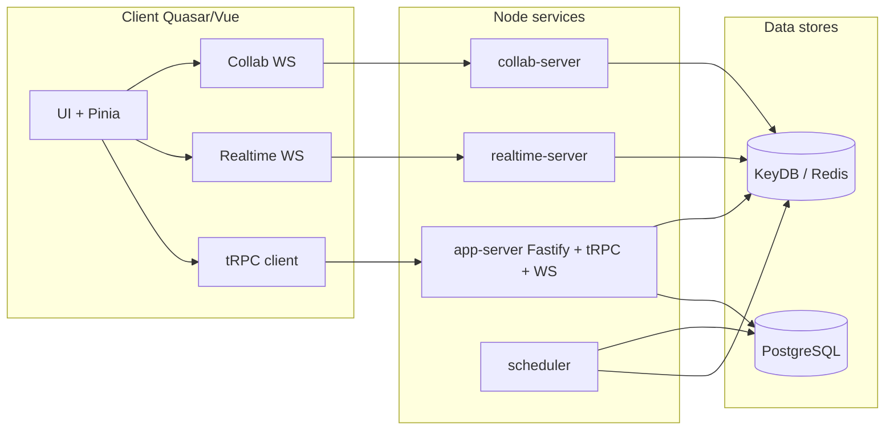

# DeepNotes — Technical overview

This document describes the **DeepNotes** codebase: architecture, services, shared libraries, data stores, tooling, and operational concerns. It is aimed at engineers onboarding to the repository or planning changes across the stack.

For product-level context (what DeepNotes is for and how it feels to use), see [NON_TECHNICAL_OVERVIEW.md](./NON_TECHNICAL_OVERVIEW.md).

---

## 1. Product and scope

DeepNotes is an **open source** (AGPL-3.0) application: an **end-to-end encrypted**, **infinite canvas** note system with **deep page nesting**, **realtime collaboration**, and flexible layouts. The public site is [deepnotes.app](https://deepnotes.app).

The repository is a **TypeScript monorepo**: multiple Node.js backend services, a Quasar/Vue client (web, SSR, Electron, Capacitor), and shared packages. There is no single “monolith” binary; production deployments wire the client to several HTTP/WebSocket endpoints.

---

## 2. Monorepo layout

| Mechanism | Role |
|-----------|------|
| **pnpm workspaces** | `package.json` `workspaces`: `apps/**`, `packages/**`; mirrored in `pnpm-workspace.yaml`. |
| **Turbo** | `turbo.json` defines pipelines for `build`, `dev`, `lint`, `repo:build`, etc. Root scripts delegate to `turbo run …`. |
| **TypeScript project references** | `tsconfig.packages.json` builds shared packages and **server apps** (not the Quasar client). Client TS is owned by Quasar/Vite. |
| **Package naming** | Apps: `@deepnotes/*`. Domain libs: `@deeplib/*`. Generic shared libs: `@stdlib/*`. |

**Root scripts (selected):**

- `pnpm run repo:build` — `tsc --build tsconfig.packages.json` then `turbo run repo:build` (compile + path aliasing for referenced packages).
- `pnpm run dev` — `turbo run dev --parallel` (all packages/apps that define `dev`).
- `pnpm run build` — `turbo run build` with dependency graph (`dependsOn: ["^build"]` for `build`).
- `pnpm test` — Vitest (repo root `vitest.config.ts`).

**Tooling:** ESLint (`eslint-config-base`), Prettier, Husky + Commitlint, Syncpack, `standard-version` (changelog skipped in config), patched `dotenv-expand` under `patches/`.

---

## 3. Applications (`apps/`)

### 3.1 `@deepnotes/client` (`apps/client/`)

- **Stack:** Vue 3, **Quasar** (including forked scoped packages such as `@deepnotes/quasar` / `@deepnotes/quasar-app-vite`), **Vite**, **Pinia**, **vue-router**, **vue-i18n**.
- **Editor / collaboration:** Tiptap / ProseMirror, **Yjs**, **y-prosemirror**, **@syncedstore/core**, **lib0** for encoding.
- **API to backend:** **tRPC v10** client (`createTRPCProxyClient`, `httpLink`) targeting `APP_SERVER_URL` (see `template.env` and client `src/code/trpc.ts`). Types are shared from `@deepnotes/app-server` (`AppRouter`).
- **Realtime:** Separate WebSocket client to `REALTIME_SERVER_URL` (e.g. `src/code/areas/realtime/`).
- **Per-page collab:** WebSocket to `COLLAB_SERVER_URL` with a binary protocol (e.g. `src/code/pages/page/collab/websocket.ts`).
- **Targets:** SPA, SSR (`src-ssr`), **Electron** (`src-electron`), **Capacitor** (`src-capacitor` for iOS/Android). Quasar feature flags and env-specific `.env.*` files drive build modes (`quasar.config.js`).
- **Crypto on client:** libsodium / related bootstrapping for E2E behavior (server stores ciphertext; see §6).

### 3.2 `@deepnotes/app-server` (`apps/app-server/`)

- **Role:** Primary **HTTP API** and auxiliary **WebSocket** routes on **Fastify**.
- **tRPC:** Router combines `users`, `sessions`, `groups`, `pages` (`src/trpc/router.ts`). Implementation lives under `src/trpc/api/**`. Context (`src/trpc/context.ts`) exposes DB/Redis abstractions, locks, Stripe, etc.
- **Auth:** Cookie-based access/refresh tokens; procedures use helpers such as `authProcedure` (`src/trpc/helpers.ts`) with JWT validation and session invalidation via Redis-backed `dataAbstraction`.
- **Other HTTP:** Stripe / RevenueCat webhooks, rate limiting, CORS, helmet, raw body where needed for signatures.
- **WebSocket (`@fastify/websocket`):** Sensitive flows (password change, key rotation, group invites, page moves, etc.) under `src/websocket/`.
- **Build/run:** TypeScript build + `tsc-alias`; production bundle via **tsup** (`bundle` script). Dockerfile uses **pnpm** and **pm2** for process management.

### 3.3 `@deepnotes/realtime-server` (`apps/realtime-server/`)

- **Role:** Dedicated **WebSocket** service for live updates / subscriptions (custom protocol using **msgpackr**).
- **Auth:** JWT from cookies on HTTP upgrade (see `src/http-server.ts`).
- **Observability:** Prometheus-compatible **`/metrics`** on the HTTP sidecar (pattern shared with collab-server).

### 3.4 `@deepnotes/collab-server` (`apps/collab-server/`)

- **Role:** **WebSocket** server for **per-page** collaborative editing (Yjs-related stack: `yjs`, `y-protocols`, awareness/update patterns).
- **URL shape:** Client connects to paths such as `…/page:{pageId}` (aligned with client collab module).
- **Metrics:** HTTP server exposes **`/metrics`** for Prometheus scraping.

### 3.5 `@deepnotes/scheduler` (`apps/scheduler/`)

- **Role:** Background worker for **scheduled cleanup** (e.g. purging soft-deleted data) using the same Redis/KeyDB and data abstractions as the app server.

### 3.6 `@deepnotes/manager` (`apps/manager/`)

- **Role:** **Interactive CLI** for operations (Redis hash inspection, user deletion, mail tests, Stripe-related tasks). Not a user-facing HTTP service like the app server.

---

## 4. Shared packages (`packages/`)

### 4.1 `@deeplib/*` (DeepNotes domain)

| Package | Purpose (high level) |
|---------|----------------------|
| `@deeplib/db` | **Objection** models on **Knex** (`UserModel`, `PageModel`, `SessionModel`, etc.). |
| `@deeplib/data` | Domain data helpers: hashing, cache-oriented patterns, integration with **data abstraction** over KeyDB. |
| `@deeplib/mail` | Email providers (SendGrid, Mailjet, Brevo, etc.). |
| `@deeplib/misc` | Shared enums, roles, small domain utilities (includes tests such as `roles.spec.ts`). |
| `@deeplib/tsconfig` | Shared TS config base for packages. |

### 4.2 `@stdlib/*` (cross-project utilities)

Includes **crypto** (wrapped data, keyrings), **data** (includes data-abstraction plumbing used from app-server context), **db**, **misc**, **vue** (e.g. smart-computed), **testing** (inline/smart mocks), **redlock**, **base64**, **color**, **nestjs** (present; not the center of gravity for the main DeepNotes apps).

### 4.3 Tooling packages

- **`eslint-config-base`** — shared ESLint rules for the workspace.

---

## 5. End-to-end architecture

**Request paths:**

1. **CRUD / business API:** Browser (or SSR server) → **HTTP** → app-server **`/trpc`** → procedures → Postgres + KeyDB via Knex/Objection and `dataAbstraction`.
2. **Live list / presence-style updates:** Client ↔ **realtime-server** WebSocket (JWT on upgrade).
3. **Document collaboration:** Client ↔ **collab-server** WebSocket for a given page (Yjs / SyncedStore stack).

**Separation of concerns:** Durable encrypted blobs and relational metadata live in **Postgres**. **KeyDB** backs fast reads/writes, locking (**redlock**), rate limits, session invalidation flags, and cache-style projections used by tRPC and workers. Exact key naming lives in `@deeplib/data` / `@stdlib/data` and server glue code.

---

## 6. Data model and persistence

### 6.1 PostgreSQL

- **Initialization:** `postgres-init.sql` is a **full pg_dump-style schema** (not a chain of incremental migration files in-repo). It enables **`pgcrypto`**, defines **`nanoid()`**, and creates all application tables.
- **ORM:** **Knex 2.3** + **Objection 3** with **`pg`** driver.
- **Major tables** (from `postgres-init.sql`): `users`, `sessions`, `devices`, `groups`, `group_members`, `group_join_invitations`, `group_join_requests`, `pages`, `users_pages`, `page_updates`, `page_snapshots`, `page_links`, `notifications`, `users_notifications`.
- **Encryption at rest (server-side):** Many columns are **`bytea`** ciphertext (names, keyrings, page updates/snapshots, etc.); encryption keys are named in `template.env` (per-field keys, distinct from JWT secrets).

### 6.2 KeyDB / Redis

- **Local stack:** `docker-compose.yml` runs **PostgreSQL 15.3** and **KeyDB 6.3.3** with `keydb.conf` and seeded DB via `postgres-init.sql`.
- **Client:** **ioredis** (scoped **`@deepnotes/ioredis`** in app dependencies).

### 6.3 Object / blob storage

No separate S3-style client is central to the reviewed layout; large content is stored as **encrypted binary in Postgres** (updates/snapshots).

---

## 7. Security, auth, and billing

- **Sessions:** HTTP-only cookies; **fast-jwt** / **jws** on server; **otplib** for 2FA-related flows.
- **WebSocket auth:** Realtime and collab verify **`ACCESS_SECRET`**-signed JWTs (cookie names such as `accessToken` / `loggedIn` on upgrade paths).
- **Crypto libraries:** libsodium (server and client wrappers), Argon2 in browser where applicable, workspace **`@stdlib/crypto`** for key handling patterns.
- **Billing:** **Stripe** in app-server and manager; **@stripe/stripe-js** on client; webhook routes validate provider signatures. **RevenueCat** webhook support exists alongside Stripe.

Environment variable **names** and local defaults are documented in **`template.env`** (never commit real secrets).

---

## 8. Local development and builds

Typical flow (from `README.md`):

1. Clone repo, `cp template.env .env`, `pnpm install`, `pnpm run repo:build`, `docker-compose up -d` (Postgres + KeyDB).
2. `pnpm run dev` — all backend `dev` scripts (often **`tsx --inspect-brk`** on servers).
3. Start the client with one of: `pnpm run dev:spa`, `dev:ssr`, `dev:electron`, `dev:android`, `dev:ios` (from root; these filter `@deepnotes/client`).
4. For SPA/SSR, default app URL is **`http://localhost:60379`** unless overridden in `.env`.

**Windows note:** README recommends **WSL or Git Bash** for shell compatibility.

**Node version drift:** Root `engines.node` is permissive (`>=14`); **CircleCI** uses **Node 18** (Linux/Windows) and **20.9.0** (macOS/Android); **Dockerfiles** in apps may pin other versions (e.g. Node 16 in some images). Align versions explicitly when debugging native or lockfile issues.

---

## 9. CI/CD

- **CircleCI** (`.circleci/config.yml`): **`deploy` workflow** on branch **`main`**, parallel jobs:
  - **deploy-linux / deploy-win / deploy-macos** — `pnpm install`, `pnpm run repo:build`, **`pnpm run build:electron:publish`** (desktop artifacts).
  - **deploy-android** — Android build, keystore from CI secrets, **Fastlane** to Play Store.
  - **deploy-ios** — iOS build, review demo metadata from env, **Fastlane** upload.

There are **no GitHub Actions** workflows in this repository; mobile/desktop release automation is CircleCI-centric.

---

## 10. Testing

- **Runner:** **Vitest** at repository root.
- **Coverage today:** Mostly **unit tests in `@stdlib/*` and `@deeplib/misc`** (e.g. `*.spec.ts` under `packages/@stdlib/testing`, `packages/@stdlib/crypto`, `packages/@stdlib/vue`, `packages/@deeplib/misc`). **App-server and client** automated test coverage is **sparse** relative to codebase size—treat changes there with extra manual verification or add tests locally.

---

## 11. Deployment artifacts

- **Docker:** Each major deployable has a **`Dockerfile`** under `apps/app-server`, `apps/realtime-server`, `apps/collab-server`, `apps/scheduler`, `apps/client` (build context and runtime differ per service).
- **Compose:** `docker-compose.yml` is suitable for **local/dev** dependencies, not a full production topology by itself.
- **Process management:** App-server container example uses **pm2** after `tsup` bundle.
- **Observability:** **prom-client** on collab/realtime HTTP endpoints (`/metrics`); **unilogr** for structured logging in servers.

---

## 12. Licensing

The project is licensed under **GNU AGPL v3** (`LICENSE`). Network-deployed forks and SaaS derivatives have copyleft obligations; verify compliance before embedding or hosting modified versions.

---

## 13. Where to read next

| Topic | Location |
|-------|----------|
| tRPC surface | `apps/app-server/src/trpc/router.ts`, `apps/app-server/src/trpc/api/**` |
| Fastify + plugins + tRPC mount | `apps/app-server/src/fastify/server.ts` |
| Client API boundary | `apps/client/src/code/areas/api-interface/**` |
| DB models | `packages/@deeplib/db/src/models/**` |
| Schema | `postgres-init.sql` |
| Env template | `template.env` |
| Product narrative | `docs/NON_TECHNICAL_OVERVIEW.md` |

---

## 14. Known gaps and caveats

- **Schema evolution:** In-repo artifact is primarily **`postgres-init.sql`**; there is no obvious Knex migrations directory—production schema upgrades may be maintained out-of-band or via dump refresh; confirm team process before altering production.
- **Test gap:** Most business logic in `apps/client` and `apps/app-server` lacks Vitest coverage; rely on typecheck, lint, manual QA, or add tests as you touch areas.
- **Runtime versions:** Harmonize Node across Docker, CI, and local dev to avoid subtle native or lockfile mismatches.

This overview reflects the tree as of the document’s authoring; when in doubt, prefer reading the cited paths over this summary.
